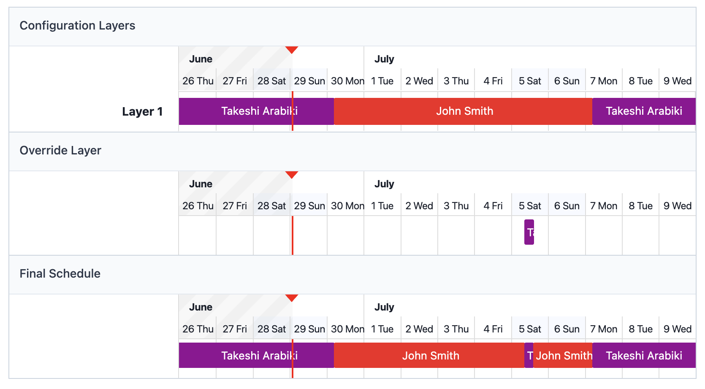

# pd-shift

[](https://github.com/abicky/pd-shift/actions/workflows/main.yaml)

`pd-shift` is a CLI tool for managing PagerDuty on-call shifts.

## Installation

### Precompiled binary

Download the binary archive from the [releases page](https://github.com/abicky/pd-shift/releases), unpack it, and move the `pd-shift` executable to a directory in your `PATH` (e.g. `/usr/local/bin`).

For example, you can install the latest binary on a Mac with Apple silicon by running the following commands:

```sh
curl -LO https://github.com/abicky/pd-shift/releases/latest/download/pd-shift_darwin_arm64.tar.gz
tar xvf pd-shift_darwin_arm64.tar.gz
mv pd-shift_darwin_arm64/pd-shift /usr/local/bin/
```

If you downloaded the archive via a browser on Mac, you may see the error

> “pd-shift” cannot be opened because the developer cannot be verified.

To resolve this, remove the "com.apple.quarantine" attribute:

```sh
xattr -d com.apple.quarantine /path/to/pd-shift
```

### Homebrew

```sh
brew install abicky/tools/pd-shift
```

### Docker

You can also run `pd-shift` via Docker. For example, to show the help message:


```sh
docker run --rm abicky/pd-shift --help
```

### From source

```sh
go install github.com/abicky/pd-shift@latest
```

Or clone and build manually:

```sh
git clone https://github.com/abicky/pd-shift
cd pd-shift
make install
```

## Usage

### Authentication

pd-shift uses a PagerDuty REST API key. You can provide it using either of the `--api-key` global flag, the `PD_SHIFT_API_KEY` environment variable, or the `api-key` field in a config file.
If you don't have a key, see the [PagerDuty document](https://support.pagerduty.com/main/docs/api-access-keys#rest-api-keys) to generate one.

### Configurations

 Property               | Required | Default           | Description
------------------------|----------|-------------------|-------------------
 api-key                | ✔        |                   | PagerDuty API key.
 config                 |          | See below         | Path to the config file.
 count.time-zone        |          | UTC               | Time zone used for `handoff-times`, `since`, and `until`.
 count.schedule-ids     | ✔        |                   | List of scheduled IDs to include in the count.
 count.handoff-times    | ✔        |                   | List of handoff times. For example, if the day shift starts at 05:00 and the night shift starts at 17:00, the value should be `["05:00", "17:00"]`.
 count.include          |          | `[]` (all shifts) | List of shifts to count. Each item is in the format `<day-type>:<start-handoff-time>-<end-handoff-time>`, where the time range is optional. For example, `["working-days:17:00-05:00", "non-working-days"]` counts night shifts on working days and all shifts on non-working days.
 count.non-working-days |          | `[]`              | List of non-working days used by `count.include`. "JP holidays", weekdays (e.g. "Sat", "Sun"), and specific dates (e.g. "Dec 31", "Jan 1") are supported.
 count.since            | ✔        |                   | Start of the date range for counting on-call shifts. For example, if `since` is "2025-01-01" and the first handoff time is "05:00", counting starts from 2025-01-01 05:00.
 count.until            | ✔        |                   | End of the date range for counting on-call shifts. For example, if `until` is "2025-02-01" and the first handoff time is "05:00", counting ends at 2025-02-01 05:00.

pd-shift loads configuration values in the following order of precedence:

1. Command line flags
    - The flag name matchjes the property name, excluding any subcommand name prefix.
2. Environment variables
    - The environment variable name is in the format `PD_SHIFT_<PROPERTY_NAME>`, where property names are uppercased and dots are replaced with underscores. (e.g. `PD_SHIFT_COUNT_TIME_ZONE`).
3. Config file
    - pd-shift searches for a config file named "config" (e.g., config.yaml) in a pd-shift directory, following the [XDG base directory specification](https://specifications.freedesktop.org/basedir-spec/0.8/)  (e.g., `$HOME/.config/pd-shift/config.yaml`).
    - Supported formats are those supported by [Viper](https://github.com/spf13/viper).

Here is an example config file in YAML format:

```yaml
# For the count subcommand
count:
  time-zone: Asia/Tokyo
  schedule-ids:
    - P4DRALL
  handoff-times:
    - 05:00
    - 17:00
  include:
    - working-days:17:00-05:00
    - non-working-days
  non-working-days:
    - JP holidays
    - Sat
    - Sun
    - Dec 29
    - Dec 30
    - Dec 31
    - Jan 1
    - Jan 2
    - Jan 3
```

### Completions

The `completion` subcommand generates an autocompletion script. For example, you can generate the autocompletion script for zsh as follows:

```sh
pd-shift completion zsh > /usr/local/share/zsh/site-functions/_pd-shift
```

If installed via Homebrew, autocompletion scripts are generated automatically.

### Count subcommand

This command subcommand counts PagerDuty on-call shifts based on the specified configuration.

Assume the following scenario:

* You want to count day shifts on working days and all shifts on non-working days.
* Day shifts start at 05:00, and night shifts start at 17:00.
* Non-working days include Japanese holidays, weekends, and the following dates: December 29, 30, 31, and January 1, 2 and 3.
* The target period is from 2025-07-01 to 2025-07-08.
* The target schedule is as follows:
    

To count the shifts in this case, run:

```console
pd-shift count \
  --time-zone Asia/Tokyo \
  --schedule-ids P4DRALL \
  --handoff-times 05:00,17:00 \
  --include working-days:17:00-05:00,non-working-days \
  --non-working-days 'JP holidays,Sat,Sun,Dec 29,Dec 30,Dec 31,Jan 1,Jan 2,Jan 3' \
  --since 2025-07-01 \
  --until 2025-07-08
```

This produces the following output:

```
# Summary

- John Smith: 7.50
- Takeshi Arabiki: 1.50
- Total: 9.00
- Expected total: 9

# Details

- Tue, 2025-07-01 17:00+0900 - Wed, 2025-07-02 05:00+0900
    - Weekly Rotation
        - John Smith: 1.00 (17:00 - 05:00)
- Wed, 2025-07-02 17:00+0900 - Thu, 2025-07-03 05:00+0900
    - Weekly Rotation
        - John Smith: 1.00 (17:00 - 05:00)
- Thu, 2025-07-03 17:00+0900 - Fri, 2025-07-04 05:00+0900
    - Weekly Rotation
        - John Smith: 1.00 (17:00 - 05:00)
- Fri, 2025-07-04 17:00+0900 - Sat, 2025-07-05 05:00+0900
    - Weekly Rotation
        - John Smith: 1.00 (17:00 - 05:00)
- Sat, 2025-07-05 05:00+0900 - Sat, 2025-07-05 17:00+0900
    - Weekly Rotation
        - John Smith: 0.33 (05:00 - 09:00)
        - Takeshi Arabiki: 0.50 (09:00 - 15:00)
        - John Smith: 0.17 (15:00 - 17:00)
- Sat, 2025-07-05 17:00+0900 - Sun, 2025-07-06 05:00+0900
    - Weekly Rotation
        - John Smith: 1.00 (17:00 - 05:00)
- Sun, 2025-07-06 05:00+0900 - Sun, 2025-07-06 17:00+0900
    - Weekly Rotation
        - John Smith: 1.00 (05:00 - 17:00)
- Sun, 2025-07-06 17:00+0900 - Mon, 2025-07-07 05:00+0900
    - Weekly Rotation
        - John Smith: 1.00 (17:00 - 05:00)
- Mon, 2025-07-07 17:00+0900 - Tue, 2025-07-08 05:00+0900
    - Weekly Rotation
        - Takeshi Arabiki: 1.00 (17:00 - 05:00)

# PagerDuty schedules

## Weekly Rotation

- 2025-07-01T05:00:00+09:00 - 2025-07-05T09:00:00+09:00: John Smith
- 2025-07-05T09:00:00+09:00 - 2025-07-05T15:00:00+09:00: Takeshi Arabiki
- 2025-07-05T15:00:00+09:00 - 2025-07-07T05:00:00+09:00: John Smith
- 2025-07-07T05:00:00+09:00 - 2025-07-08T05:00:00+09:00: Takeshi Arabiki
```

## Author

Takeshi Arabiki ([@abicky](https://github.com/abicky))
